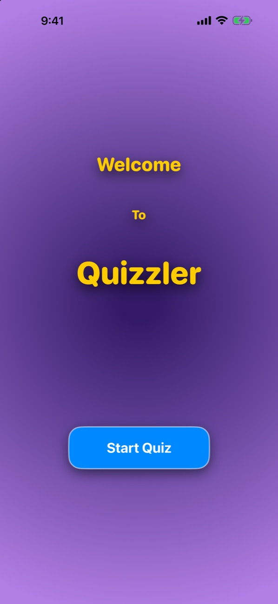
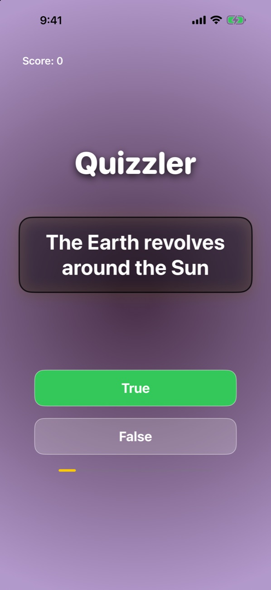
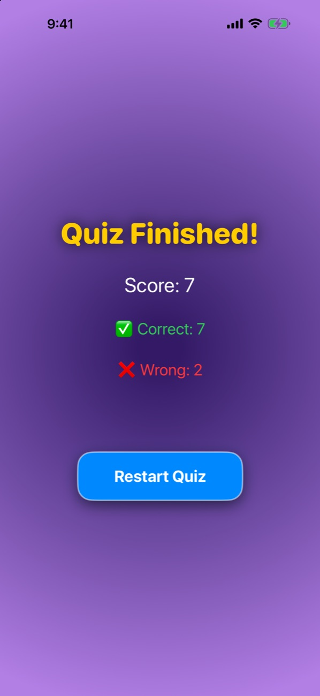

<div align="center">

# Quizzler

**A bite-sized true-or-false trivia game for iPhone — tap, learn, and see your score instantly.**


&nbsp;&nbsp;
&nbsp;&nbsp;


</div>

---

## Why Quizzler?

Most quiz apps bury the fun under menus and sign-ups. Quizzler is one tap from start to finish: a bold welcome screen, a question card, two big buttons, and a scoreboard at the end. It's built to feel quick and satisfying, with every answer lighting up green or red the moment you tap.

## Highlights

- **Instant feedback.** The correct answer glows green and a wrong pick flashes red, then the next question slides in half a second later.
- **Live score and progress.** Your running score sits in the corner and a progress bar tracks how far through the round you are.
- **Clear results.** At the end you get your total score with a ✅ correct / ❌ wrong breakdown and a one-tap **Restart Quiz**.
- **Polished look.** Radial-gradient backgrounds, rounded heavy type, glassy question cards and soft shadows throughout.

## How it works

Quizzler follows a clean **MVVM** structure:

| Layer | File | Role |
|---|---|---|
| Model | `Question.swift`, `QuizBrain.swift` | The question bank and quiz logic: scoring, progress and moving to the next question |
| ViewModel | `QuizViewModel.swift` | An `ObservableObject` that publishes the current question, the selected answer, the score and the finished state |
| Views | `WelcomeView`, `ContentView`, `ResultView`, `RootView` | `RootView` switches between welcome → quiz → results using shared state |

Adding questions takes one line in `QuizBrain.swift`:

```swift
Question(q: "The currency of Japan is the Yen", a: "True"),
```

## Getting started

1. Clone the repo and open `QuizApp.xcodeproj` in Xcode.
2. Pick an iPhone simulator and press **⌘R**.

## About

Built by **Roszhan Raj** for CPSC 411 (iOS Development) at California State University, Fullerton.
